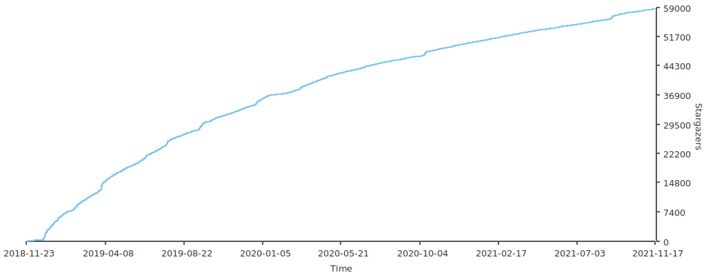

[](https://travis-ci.com/MaoLongLong/java-design-pattern)
[](https://codecov.io/gh/MaoLongLong/java-design-pattern)
[](https://www.oracle.com/java/technologies/javase/javase-jdk8-downloads.html)
[](https://github.com/MaoLongLong/java-design-pattern)

设计模式（Design Pattern）是前辈们对代码开发经验的总结，是解决特定问题的一系列套路。它不是语法规定，而是一套用来提高代码可复用性、可维护性、可读性、稳健性以及安全性的解决方案。

本项目用 maven 构建，使用 java8 进行简单实现，另外每种模式都有对应的 UML 类图进行描述。

```bash
git clone https://github.com/MaoLongLong/java-design-pattern.git
cd java-design-pattern

# compile and test
mvnw.cmd clean test  # on windows
./mvnw clean test  # on linux
```

GitHub 国内访问速度较慢，所以我还维护了一个 [Gitee](https://gitee.com/maolonglong/java-design-pattern) 的镜像仓库。

## Stargazers over time


