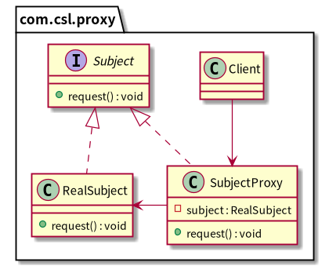

# 代理模式

**代理模式（Proxy）**，为其他对象提供一种代理以控制对这个对象的访问。

非常重要的一种设计模式，在 Spring 的 AOP 中有大量使用，除了简单的静态代理之外，更常用的有 JDK 动态代理和 Cglib 代理。

- JDK 动态代理要求被代理类必须实现接口，因为它是通过实现接口进行代理。
- Cglib 则不要求被代理类实现接口，它是通过操作字节码，在运行时动态生成被代理类的子类。
